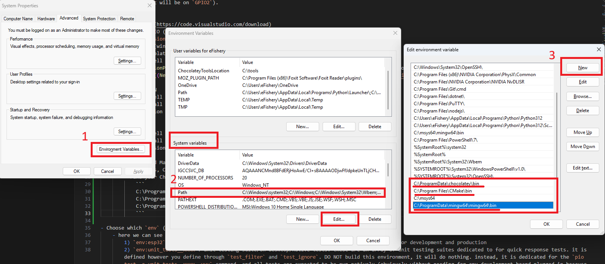
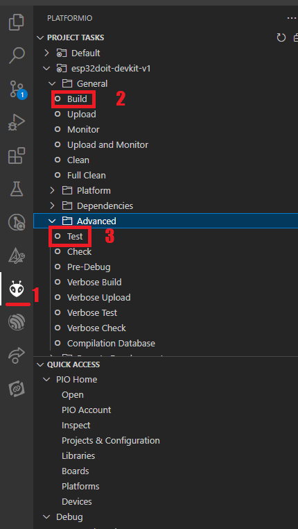

# Unit Testing on Platform IO based ESP IDF

This codebase is a simple example on how to do automated testing directly in PlatformIO, for ESP IDF based development.

> The `main.cpp` doesn't really matter, it is NOT NEEDED AT ALL to run Unit Tests. This is due to the spirit of testing is to test each individual component seperately, regardless of the `app_main()` logic. Hence, here we want to test out `AppLight.hpp`, which consists of an abstraction of the `LED_BUILTIN` on the DOIT ESP32 DEVKIT V1 (it will be on `GPIO2`).

### Table of Content
    ```
    WIP
    ```

## Getting Started
- Install [VSCode](https://code.visualstudio.com/download)
- Install PlatformIO (PIO) Extension in VSCode
    - Go to `Extensions` on the left side bar, search for PlatformIO
- Install tools for build (windows version, for other OS, find them yourself 😛) -- if not isntalled properly, will later cause PlatformIO to fail to run `build` or `test`
    - Install Chocolatey
        ```powershell
        Set-ExecutionPolicy Bypass -Scope Process -Force; [System.Net.ServicePointManager]::SecurityProtocol = [System.Net.ServicePointManager]::SecurityProtocol -bor 3072; iex ((New-Object System.Net.WebClient).DownloadString('https://community.chocolatey.org/install.ps1'))
        ```
    - Install MinGW
        ```powershell
        choco install mingw -y
        gcc --version
        ```
    - Install Make
        ```powershell
        choco install make -y
        make --version
        ```
    - Add MinGW and Make to PATH (if not automatically added)
        - Sometimes, Chocolatey may not automatically add the installed tools to your system PATH. You can manually add them if needed.
        - Find your Chocolatey, MinGW, Make location. add them to the Path in System Variables, for me it's these
            ```
            C:\ProgramData\chocolatey\bin
            C:\Program Files\CMake\bin
            C:\ProgramData\mingw64\mingw64\bin
            ```
            

- Choose which platform io `env` (environment) you want to run
    - here we can see there are 3 types of environments that I have prepared
        1) `env:esp32`: application to build & flash. this is the default environment which is meant for development and production
        2) `env:unit_tests__xxxx`: unit testing suite/on desktop/native tests. these are an array of unit testing suites dedicated to for quick response tests. it is defined however you define through `test_filter` and `test_ignore`. DO NOT build this environment, it will do nothing. instead, it is dedicated for the `pio test -e unit_tests__xxxx -vvv` command, and all tests are expected to be run natively (obviously without needing for any development board plugged in because no flashing)
        3) `env:integration_tests__xxxx`: integration testing suite/on device tests. these are an array of integration tests expected to be long in response (need to flash first) tests. it is defined however you define through `test_filter` and `test_ignore`. DO NOT build this environment, it will do nothing. instead, it is dedicated for the `pio test -e unit_tests__xxxx -vvv` command, and will then do the flashing to the development board, and after it be flashed, the tests will run
        3) `env:e2e_tests__xxxx`: end-to-end testing suite/on device tests. these are an array of end-to-end tests expected to be long in response (need to flash first) tests.

            

### Building & Flashing
- Open the `platform.ini` file, let PIO to load and install the required platform (espressif32@5.3.0)
    - This will take some time, because (if not yet) you need to download the whole choice of platform, in this case is `espressif32@5.3.0` (in which already has ESP IDF within). I had specified to use the version `5.3.0`, because I tried the current latest version, which is `6.2.0`, and it keeps on failing to compile with a certain error. Hence, I specified an older version which actually works
    - After the PIO Task of Downloading the platform is done, usually it does another PIO task, which is to "Configure project". Just wait for another while, after done, continue to the next step
- Open the PlatformIO tab, the image below will show up (if not yet, just try opening up the `platform.ini` file again, it sometimes fail to load)

    

    - `General` > `Build` Just wait until it successfully to Builds
        

### Testing
- `Advanced` > `Test`
    -  Just wait until this text shows up
    ```
        Testing...
        If you don't see any output for the first 10 secs, please reset board (press reset button)
    ```
    - Press the reset button on the ESP32, then the Unit Test will run, the `LED_BUILTIN` will flash really briefly, and this final success test message will popup
    
    

## A Guide on Unit Testing
### GoogleTest Testing Framework
- [A guide to using Google Test](https://google.github.io/googletest/primer.html)
    - `TEST()` -- a simple test, without fixtures
    - `TEST_F()` -- test with fixtures `When multiple tests in a test suite need to share common objects and subroutines, you can put them into a test fixture class.`
    - `testing::Test` -- [creating test fixtures](https://google.github.io/googletest/primer.html#same-data-multiple-tests)
        - `void SetUp() override {...}`
        - `void TearDown() override {...}`
    - running tests
        ```cpp
        // main.test.cpp
        int main(int argc, char **argv) {
            testing::InitGoogleTest(&argc, argv);
            return RUN_ALL_TESTS();
        }
        ```
    - fakes/mocks/stubs -- [gmock for dummies](https://google.github.io/googletest/gmock_for_dummies.html)

### Test Naming Conventions
- BDD Style: The BDD-style naming convention (should_do_x_when_being_done_y). This naming convention makes the test cases more readable and aligns with the BDD philosophy of focusing on the behavior of the system.

```cpp
#include <gtest/gtest.h>

// Test case using the BDD naming convention in snake_case
TEST(AddFunctionTest, should_return_sum_when_given_two_positive_numbers) {
    // Arrange
    int a = 5;
    int b = 10;

    // Act
    int result = Add(a, b);

    // Assert
    EXPECT_EQ(result, 15);
}
```

### Foldering
- `lib`: for all components that are expected to be tested, make sure are placed here. components in `src/` are by default NOT seen in the test suite
- `test`
    - `unit_tests`: all unit tests running natively on desktop (off device)
    - `integration_tests`: all tests that utilizes an external or platform based libraries/implementations, running on device (requires flashing)
    - `e2e_tests`: all tests that runs an automated end-to-end real life usage scenarios, running on device (requires flashing)

### Platform.ini breakdown
- common platform environments: add more platforms as needed
    ```
    ; -------- COMMON PLATFORM ENVIRONMENTS --------
    [env:esp32]
    ...

    [env:platform_name]
    ...
    ```

- unit test environments:  all tests that will be run natively in the desktop and are expected to run FAST. tests that fall into this category fits the name unit test, knowing that it will be fired rapidly during every incremental development. all platform specific components (esp idf, arduino) MUST be mocked!
    - to learn more, read [Platform IO Docs > Unit Testing > Test Hierarchy: Pizza Project Tests](https://docs.platformio.org/en/latest/advanced/unit-testing/structure/hierarchy.html)
    ```
    ; -------- UNIT TESTS ENVIRONMENTS --------

    [env:unit_tests__test_native]
    test_filter = unit_tests/* ; whitelist
    test_ignore = integration_tests/* ; blacklist

    [env:unit_tests__test_component_name_or_cluster]
    ...
    ```
- integration tests: a list of integrations tests. this focuses on tests that utilize external or platform based libraries/implementations on real hardware and tests components as their own seperate tests, to verify hardware functionality to be as expected. you can make different testing scenarios using real hardware with this
    - it is recommended to further integrate the integration testing with a CI system, and utilize a testing dock for semi-permanently connected devices for better a integration testing experience
    ```
    ; -------- INTEGRATION TESTS ENVIRONMENTS --------
    [env:integration_tests__test_esp32]

    ```

- end-to-end tests: a list of integrations tests. this focuses on tests that will use real life scenarios of usage, it would usually use multiple functions to serve an end-to-end scenario since the device get's turned on, until it perhaps sleeps or terminates it's state. 
    - it is recommended to further integrate the integration testing with a CI system, and utilize a testing dock for semi-permanently connected devices for better a integration testing experience
    ```
    ; -------- END-TO-END TESTS ENVIRONMENTS --------
    [env:integration_tests__test_esp32]

    ```

### Error Findings
- Solution to `Undefined Reference` Error: Place `.hpp` and `.cpp` of testable components within `{root}/lib`
    - another solution is to use [`test_build_src = yes`](https://docs.platformio.org/en/latest/projectconf/sections/env/options/test/test_build_src.html) inside `platform.ini`, but this is not so recommended especially when running a `platform = native` test, because all dependencies to `ESP-IDF` or `Arduino` will break and cause you a major headache! 🤮
    
        

    - source: [forum @ community.platformio.org](https://community.platformio.org/t/unit-tests-platformio-googletest-errors-linking/28529)

- do not utilize `build_type = test`, because it will let pio to do the testing without properly invoking gtest, therefore getting stuck (pio error) and the Test pio feature will be disabled. without this line, all runs fine

### Unit Testing in ESP IDF (not Platform IO)
- work in progress, checkout [royyandzakiy/unittesting-espidf-unity](https://github.com/royyandzakiy/unittesting-espidf-unity)

---
## Disclaimer
I did not write the code `AppLight`, it is from [PacktPublishing - Developing IoT Projects with ESP32 2nd edition](https://github.com/PacktPublishing/Developing-IoT-Projects-with-ESP32-2nd-edition) :octocat:. I made minor changes mainly to divert from the initial target which is directed for ESP32S3 to a ESP32